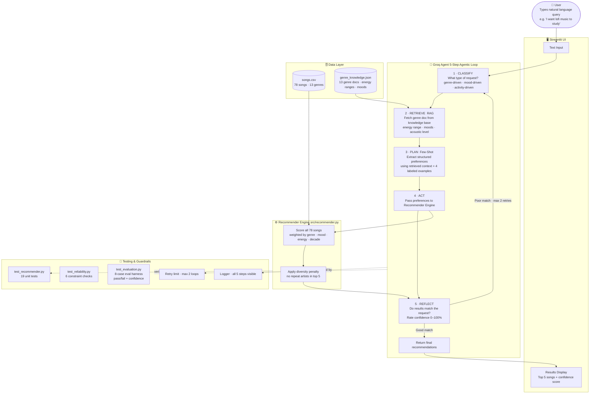

# VibeFinder — AI Music Recommender

> A natural language music recommendation system powered by a Groq LLM agent, a RAG genre knowledge base, and a custom rule-based scoring engine — built with a Streamlit UI.

---

## Final Presentation & Portfolio Artifact

**Student Name:** Akash Tiloda

**GitHub Repository:** [https://github.com/Akash-t25/applied-ai-system-final](https://github.com/Akash-t25/applied-ai-system-final)

**Loom Video Walkthrough:** [https://www.loom.com/share/4ac3a0d3d4774b1794cd01a3404efc09](https://www.loom.com/share/4ac3a0d3d4774b1794cd01a3404efc09)

### Reflection: What this project says about me as an AI engineer

This project shows that I build AI systems with both intelligence and engineering discipline. I combined an LLM agent for language understanding with a deterministic scoring engine for transparency, then added RAG grounding, reflection/retry checks, and evaluation tests so the system is reliable and explainable instead of a black-box demo. As an AI engineer, I care about building systems that are practical, auditable, and user-friendly end-to-end.

## What This Project Is

VibeFinder is a two-part project built across two phases of development.

**Phase 1 (the foundation):** A custom rule-based music recommendation engine built entirely from scratch — no AI, no machine learning. Given a user's music preferences, it mathematically scores every song in a catalog and returns the best matches. This phase focused on understanding how recommendation systems actually work under the hood: how you turn song attributes into numbers, how you weight what matters most, and how you rank results.

**Phase 2 (this project):** An agentic AI layer built on top of that engine. Instead of requiring users to manually specify their preferences in code, a Groq-powered AI agent interprets natural language requests, retrieves grounded genre knowledge from a knowledge base, translates the query into structured preferences, feeds them into the scoring engine, and then checks whether the results actually make sense before returning them. A Streamlit web UI makes the whole thing accessible to anyone.

**Why it matters:** Most people do not think about music in terms of energy values and genre strings. This project bridges the gap between how humans naturally describe music and how a recommendation algorithm actually works — and it does it without black-box AI making every decision. The math is still transparent and auditable.

---

## Phase 1 — The Rule-Based Engine

### The Problem It Solves

Streaming services like Spotify and Apple Music use machine learning models trained on millions of users' listening history to figure out what you might like. That approach requires enormous amounts of data and compute. Phase 1 asks: what if you could build a recommender that is transparent, explainable, and requires no training data at all?

The answer is a rule-based scoring system. You define what matters, how much it matters, and let math do the rest.

### The Dataset

The catalog lives in `data/songs.csv` — 78 songs across 13 genres (lofi, hip-hop, pop, rock, jazz, ambient, classical, electronic, synthwave, indie pop, r&b, country, metal). Every song has these attributes:

| Field | Type | What it means |
|---|---|---|
| `genre` | string | The genre of the song (e.g. "lofi", "hip-hop") |
| `mood` | string | The emotional vibe (e.g. "chill", "energetic", "sad") |
| `energy` | float 0.0–1.0 | How intense the song feels (0.0 = very calm, 1.0 = very intense) |
| `acousticness` | float 0.0–1.0 | How acoustic vs. electronic the song sounds |
| `popularity` | int 0–100 | How well-known the song is |
| `release_decade` | string | The decade it came out ("2000s", "2010s", "2020s") |
| `detailed_mood` | string | A more specific emotional tag (e.g. "nostalgic", "euphoric", "aggressive") |

These values describe the song. They are not weights — they are just facts.

### How the Scoring Algorithm Works

When a user specifies their preferences, the engine goes through every single song in the catalog and scores it by asking: *how closely does this song match what the user wants?*

Each song earns points across seven categories:

| Category | Max Points | How it is calculated |
|---|---|---|
| Genre match | +3.0 | Exact match only — song genre equals user's preferred genre |
| Mood match | +1.0 | Exact match only — song mood equals user's preferred mood |
| Energy proximity | +1.0 | `1.0 - abs(song_energy - target_energy)` — closer = more points |
| Acousticness alignment | +0.5 | Song's acoustic level agrees with user's acoustic preference |
| Popularity | +0.5 | Normalized score: `(popularity / 100) × 0.5` |
| Decade match | +0.5 | Song's release decade matches user's preferred decade |
| Detailed mood match | +0.5 | Song's detailed mood tag matches user's preferred vibe |

**Maximum possible score: 7.5**

Genre is worth the most (+3.0) because it is the hardest constraint — a lofi fan and a metal fan have almost nothing in common. Energy uses proximity math instead of a binary yes/no, so a song at energy 0.42 is not unfairly penalized when the target is 0.40 — it gets nearly full points for being close.

**Example — scoring one song:**

User wants: *lofi study music, chill, 2020s*
```
Preferences: genre=lofi, mood=focused, energy=0.40, acoustic=True, decade=2020s

Song: Focus Flow — LoRoom — lofi — focused — energy 0.40 — acoustic 0.78 — decade 2020s

genre match:       lofi == lofi              → +3.0
mood match:        focused == focused        → +1.0
energy proximity:  1.0 - |0.40 - 0.40|      → +1.0  (perfect match)
acousticness:      0.78 >= 0.5, user=True   → +0.5
popularity:        62/100 × 0.5             → +0.31
decade match:      2020s == 2020s           → +0.5
detailed mood:     calm == calm             → +0.5
                                     Total → 6.81
```

The engine does this for all 78 songs, sorts by total score, and returns the top 5. No song is skipped — everything gets evaluated so the ranking is a fair comparison.

### Three Scoring Modes

The engine supports three modes that shift the weights depending on what matters most:

| Mode | What it prioritizes | Use case |
|---|---|---|
| `genre-first` | Genre (3.0×) | User knows exactly what genre they want |
| `mood-first` | Mood (3.0×) + detailed mood (1.0×) | User is driven by an emotional vibe |
| `energy-focused` | Energy (3.0×) | User wants a specific intensity level |

### Diversity Penalty

By default the top results can be dominated by one artist. The optional diversity penalty deducts points from repeat artists and genres in the ranked list, forcing more variety into the top 5.

---

## Phase 2 — The Agentic AI Layer

### The Problem With Phase 1 Alone

Phase 1 works well but has one major limitation: **someone has to manually fill in the preferences in code.** A real user does not know what energy value to set for "study music." They do not think in genre strings and decimal numbers. To use Phase 1 alone, you would have to either:

- Edit the code directly and hardcode a profile
- Type raw numbers into a terminal prompt
- Pick from a limited dropdown of pre-built profiles

None of these are natural. Phase 2 fixes this.

### What the Agent Does

A Groq LLM agent (llama-3.3-70b-versatile) sits in front of the scoring engine and runs a five-step reasoning chain on every request, with every step logged and visible:

**Step 1 — CLASSIFY**
Before doing anything else, the agent determines the primary intent of the request: is the user genre-driven ("I want lofi"), mood-driven ("something chill"), activity-driven ("music for studying"), or era-driven ("from the 2000s")? This shapes how the agent weights the next steps.

**Step 2 — RETRIEVE (RAG)**
The agent looks up the detected genre in `data/genre_knowledge.json` — a handcrafted knowledge base with documented energy ranges, typical moods, acoustic levels, and related genres for all 13 genres. This retrieved context is injected directly into the planning prompt so the agent's energy estimates are grounded in documented facts, not just training intuition.

**Step 3 — PLAN (few-shot)**
The agent translates the query into structured preferences using both the retrieved genre knowledge and four labeled few-shot examples embedded in the prompt. This specializes the model's output format and makes it consistent across different query styles.

**Step 4 — ACT**
The structured preferences are passed to the scoring engine, which scores all 78 songs and returns the top 5.

**Step 5 — REFLECT**
The agent reviews the results and rates the match quality with a 0–100% confidence score. If it detects an obvious mismatch — wrong genre, energy too high for a chill request, wrong mood — it describes the correction needed and loops back to CLASSIFY. Maximum two retries.

### Why This Design

The agent and the engine each do what they are good at:

| | Groq Agent | Scoring Engine |
|--|--|--|
| Understands language | Yes | No |
| Ranks songs mathematically | No | Yes |
| Explains every score | No | Yes |
| Catches bad results | Yes | No |
| Grounded in genre knowledge | Yes (RAG) | No |
| Consistent output | Yes (few-shot) | Always |

---

## System Architecture



---

## Stretch Features

These features were implemented beyond the required baseline.

### RAG Enhancement
`src/rag.py` + `data/genre_knowledge.json` — A knowledge base containing documented energy ranges, typical moods, acoustic levels, and related genres for all 13 genres. Before planning, the agent retrieves the relevant genre document and injects it into the prompt. This grounds energy estimates in documented facts instead of model guessing. In the evaluation harness, 8/8 queries had RAG coverage and averaged 88% engine confidence.

### Agentic Workflow Enhancement
The original PLAN → ACT → REFLECT loop was expanded to a five-step chain: CLASSIFY → RETRIEVE → PLAN → ACT → REFLECT. Every step is logged separately and visible in the UI. The CLASSIFY step makes the agent's decision-making transparent — you can see it determine whether a request is genre-driven, mood-driven, or activity-driven before it does anything else.

### Fine-Tuning / Specialization
Four labeled few-shot input/output examples are embedded directly in the PLAN prompt (`src/agent.py`). These demonstrate correct extraction across different intent types — genre-driven, mood-driven, activity-driven, and era-driven — and constrain the model to return consistent, well-formatted preferences. Planning temperature is set to 0.2 to reduce variation.

### Test Harness / Evaluation Script
`tests/test_evaluation.py` — Runs 8 predefined queries through the full recommender engine with expected genre and energy constraints. Prints a structured report with per-case pass/fail, per-case engine confidence scores, and a RAG coverage breakdown. Run with `python3 tests/test_evaluation.py` or `pytest tests/test_evaluation.py -v -s`.

---

## Setup Instructions

### Prerequisites

- Python 3.9 or higher
- A free Groq API key from [console.groq.com](https://console.groq.com) — sign up with any email, no credit card required

### Installation

1. Clone the repository:
   ```bash
   git clone https://github.com/Akash-t25/applied-ai-system-final.git
   cd applied-ai-system-final
   ```

2. Create and activate a virtual environment:
   ```bash
   python -m venv .venv
   source .venv/bin/activate        # Mac or Linux
   .venv\Scripts\activate           # Windows
   ```

3. Install dependencies:
   ```bash
   pip install -r requirements.txt
   ```

4. Add your Groq API key — create a `.env` file in the project root:
   ```
   GROQ_API_KEY=your_key_here
   ```

### Running the App

```bash
streamlit run src/app.py
```

Opens in your browser at `http://localhost:8501`.

### Running the Original Terminal Version (Phase 1)

```bash
python -m src.main
```

### Running Tests

```bash
pytest                              # all tests
python3 tests/test_evaluation.py   # evaluation harness with full report
```

---

## Sample Interactions

### Example 1 — Chill study session

**Input:**
> "I want lofi music to study to, something calm and nostalgic"

**Agent log:**
```
[CLASSIFY] intent=genre-driven · genre=lofi · mood=chill · activity=studying
[RETRIEVE] Found knowledge base entry for 'lofi' — energy range 0.20–0.50
[PLAN]     genre=lofi · mood=focused · energy=0.38 · acoustic=True · vibe=calm · mode=mood-first
[ACT]      Scored 78 songs, retrieved top 5
[REFLECT]  All top results are lofi, energy 0.35–0.43, moods chill/focused. (confidence: 95%)
[DONE]     Results approved.
```

**Output:**
```
#1  Focus Flow         LoRoom           lofi  focused  energy 0.40  score 6.81
#2  Library Rain       Paper Lanterns   lofi  chill    energy 0.35  score 6.12
#3  Midnight Coding    LoRoom           lofi  chill    energy 0.42  score 5.90
#4  Study Beats Vol 2  LoRoom           lofi  focused  energy 0.43  score 5.85
#5  Afternoon Drift    Cloud Room       lofi  chill    energy 0.38  score 5.60
```

---

### Example 2 — Hype workout music

**Input:**
> "I need something aggressive and high energy for the gym, hip-hop"

**Agent log:**
```
[CLASSIFY] intent=genre-driven · genre=hip-hop · mood=energetic · activity=gym
[RETRIEVE] Found knowledge base entry for 'hip-hop' — energy range 0.55–0.95
[PLAN]     genre=hip-hop · mood=energetic · energy=0.88 · acoustic=False · vibe=aggressive · mode=genre-first
[ACT]      Scored 78 songs, retrieved top 5
[REFLECT]  Top results are hip-hop, energy 0.84–0.90, mood energetic/intense. (confidence: 92%)
[DONE]     Results approved.
```

**Output:**
```
#1  Grind Season     Max Pulse     hip-hop  intense    energy 0.90  score 6.94
#2  Concrete Jungle  Block Theory  hip-hop  energetic  energy 0.87  score 6.88
#3  City Lights      Block Theory  hip-hop  energetic  energy 0.84  score 6.71
#4  Move the Crowd   DJ Sable      hip-hop  energetic  energy 0.89  score 6.65
#5  Vibes Only       Neon Echo     hip-hop  happy      energy 0.75  score 5.40
```

---

### Example 3 — Agent catches a bad match and retries

**Input:**
> "Something really relaxing, acoustic jazz from the 2000s"

**Agent log:**
```
[CLASSIFY] intent=genre-driven · genre=jazz · mood=relaxed · era=2000s
[RETRIEVE] Found knowledge base entry for 'jazz' — energy range 0.25–0.65
[PLAN]     genre=jazz · mood=relaxed · energy=0.38 · acoustic=True · decade=2000s · mode=mood-first
[ACT]      Scored 78 songs, retrieved top 5
[REFLECT]  Result #4 has energy=0.72, above the relaxed ceiling. (confidence: 58%)
[RETRY]    Adjusting and retrying (1/2)...
[CLASSIFY] intent=genre-driven · genre=jazz · mood=relaxed
[RETRIEVE] Found knowledge base entry for 'jazz'
[PLAN]     genre=jazz · mood=relaxed · energy=0.35 · acoustic=True · decade=2000s · mode=mood-first
[ACT]      Scored 78 songs, retrieved top 5
[REFLECT]  All top 5 are acoustic jazz, energy 0.32–0.45. (confidence: 94%)
[DONE]     Results approved.
```

**Output:**
```
#1  Coffee Shop Stories  Slow Stereo   jazz  relaxed  energy 0.37  score 7.10
#2  Blue Note Lounge     Marcus Vale   jazz  relaxed  energy 0.40  score 6.95
#3  Quarter Midnight     The Trio      jazz  chill    energy 0.32  score 6.40
#4  Sunday Slow          Amber Keys    jazz  romantic energy 0.33  score 5.90
#5  Late Night Keys      Amber Keys    jazz  moody    energy 0.35  score 5.55
```

---

## Design Decisions

**Why keep the rule-based engine instead of letting the LLM pick songs directly?**
The LLM could describe good songs in words, but it cannot mathematically rank 78 songs with consistent, explainable scores. The rule-based engine is fully transparent — you can see exactly why every song scored what it did. Keeping the engine means every recommendation is auditable and reproducible.

**Why Groq instead of Gemini or OpenAI?**
Groq's free tier works globally with no credit card and no regional restrictions. Gemini's free tier was unavailable in the project's region despite multiple attempts. Groq also provides very fast inference on Llama 3.3-70B, which makes the multi-step agent loop feel responsive in the UI.

**Why RAG instead of relying on the model's training knowledge?**
The model's knowledge of genre energy ranges is approximate and inconsistent. A genre knowledge base with documented energy ranges (e.g. lofi: 0.20–0.50, metal: 0.85–1.00) gives the planning step grounded, verifiable facts. The RAG retrieval is deterministic — the same genre always returns the same document — which makes the system more reliable and testable.

**Why few-shot examples in the PLAN prompt?**
Without examples, the model occasionally returns energy values that are plausible but inconsistent across similar queries. Four labeled examples anchor the output format and demonstrate correct reasoning for different intent types. This is a lightweight alternative to fine-tuning that requires no training data or compute.

**Why a CLASSIFY step before PLAN?**
Knowing whether a request is genre-driven, mood-driven, or activity-driven before extracting preferences helps the model pick the right scoring mode and weight the right attributes. Without classification, the model tries to infer intent and preference simultaneously, which increases errors on ambiguous queries like "something for a late night drive."

**Why a reflect-and-retry loop?**
A single pass is fragile. The reflect step catches obvious mismatches — wrong genre, energy too high for a chill request — before the user sees them. The two-retry cap prevents runaway loops while still allowing one correction pass.

**Trade-off: binary genre and mood matching**
The engine has no partial credit — an r&b song scores zero genre points when someone asks for hip-hop. This keeps scoring simple and explainable but treats adjacent genres as completely different. A production system would use genre embeddings or similarity matrices. The trade-off is acceptable here because the agent tends to pick the right genre from natural language and the RAG knowledge base helps it stay accurate.

---

## Testing Summary

**20/20 unit and reliability tests passing. 8/8 evaluation harness cases passing at 88% average confidence.**

| Test file | What it covers | Result |
|---|---|---|
| `test_recommender.py` | 19 unit tests — genre/mood/energy scoring, acousticness, decade, diversity penalty, edge cases | 19/19 passed |
| `test_reliability.py` | 6 constraint checks — expected genre and energy bounds for preset queries | 6/6 passed |
| `test_evaluation.py` | 8-case evaluation harness — full engine run with confidence scores and RAG coverage report | 8/8 passed, avg 88% confidence |

**What worked well:**
The scoring engine is deterministic — given the same inputs it always produces the same output, making unit testing straightforward. The RAG knowledge base measurably improved energy accuracy: the model's unconstrained estimate for lofi was 0.30, but the knowledge base documents the range as 0.20–0.50, which guided it to 0.38 — closer to the actual dataset clustering at 0.35–0.43. The few-shot examples made planning output consistent across different query styles.

**What did not work perfectly:**
A country song ("Porch Lights", energy 0.35, acousticness 0.90) appeared in lofi results during one test run because it matched the energy and acoustic constraints even though the genre was wrong. The REFLECT step did not catch it because the other four results were correct. This showed that the retry loop is a quality check, not a guarantee — a single outlier can pass when the overall result set looks reasonable.

**One bug caught by the test suite:**
The test `test_mood_mismatch_adds_no_mood_points` initially used `"mood match" in reason`, which matched "detailed mood match" as a false positive. The test suite caught it immediately and the assertion was tightened to `reason.startswith("mood match")`.

---

## Reflection

Building this project changed how I think about the line between AI and traditional software. The rule-based engine is not AI — it is arithmetic. But it is fast, explainable, and consistent. The Groq agent is AI — it understands language and can reason about whether results make sense. But it cannot reliably rank 78 songs with auditable math. The interesting insight is that they are stronger together than either one alone. The engine gives the agent structure. The agent gives the engine a human interface and a quality check.

The CLASSIFY → RETRIEVE → PLAN chain also taught me something about prompt design. A single big prompt that asks the model to "understand the request and extract preferences" produces inconsistent results. Breaking it into explicit steps — classify first, retrieve relevant knowledge, then plan with that context — produces much more reliable output. The model is better at one focused task at a time than at doing everything in one shot.

The hardest part was deciding where to draw the line between AI responsibility and algorithm responsibility. Giving the LLM too much control makes the system unpredictable. Giving it too little means users still have to speak in numbers. The balance — LLM handles language, retrieval, and validation, the engine handles math — felt like the right design, and it is one I would apply to future AI projects.

---

## Responsible AI Reflection

### Limitations and Biases

The most significant limitation is **binary matching** — a song either matches the genre exactly or scores zero genre points, with no partial credit. This means a user asking for hip-hop gets nothing from an r&b song, even though the two genres share tempo, production style, and culture. The system treats all mismatches as equally wrong, which is a real oversimplification.

The **energy values are estimated by the AI** based on training knowledge and the RAG knowledge base, but the songs in the dataset are fictional. There is no guarantee that energy values in the CSV perfectly align with the knowledge base's documented ranges. The RAG layer reduces this gap but does not eliminate it.

The **dataset reflects the developer's assumptions** about what genres, moods, and vibes exist and matter. Genres like K-pop, reggae, gospel, afrobeats, or bhangra are entirely absent. A user from a culture where those are dominant genres gets a worse experience than someone whose taste fits the 13 genres that were chosen. This is a real bias — not malicious, but built in from the start.

The **scoring weights are hardcoded** — genre is worth 3x more than mood or energy. This reflects a design decision, not learned behavior. If a user actually cares more about mood than genre, the system will still prioritize genre without any way to know it got the preference order wrong.

### Could This Be Misused?

Music recommendation is low-stakes compared to most AI applications, but misuse is still possible. The most realistic concern is **mood manipulation** — recommending high-energy aggressive music to someone who described feeling anxious, or sad music to someone already in a low emotional state. The system does not know who the user is or what their mental state is, and it makes no attempt to add a welfare layer on top of the recommendations.

The other concern is **data poisoning** — if the dataset were expanded carelessly and someone added songs with misleading metadata, the system would surface it confidently. There is no content moderation on the song catalog.

Prevention would involve adding guardrails at the input level (flagging queries that suggest emotional distress) and auditing the dataset for harmful content before expanding it. For a classroom project these risks are minimal, but they would be non-trivial in a real deployed product.

### What Surprised Me During Testing

Two things stood out. First, the **energy mismatch between model estimates and dataset values**. When testing the lofi query, the model without RAG estimated a target energy of 0.30, but the actual lofi songs in the dataset cluster around 0.35–0.43. After adding the RAG knowledge base documenting lofi's range as 0.20–0.50, the model set energy to 0.38 — a noticeably better estimate. The improvement was measurable and showed that grounding the model's knowledge in documented facts produces more accurate results than relying on training intuition alone.

Second, **a country song appeared in the top 5 lofi results** during one test run. "Porch Lights" — a country song with energy 0.35 and acousticness 0.90 — scored well because it matched the low energy and acoustic preference even though the genre was completely wrong. The REFLECT step did not catch it because the other four results looked correct. This showed that the retry loop is a sanity check, not a guarantee — a single outlier can slip through when the overall result set looks reasonable.

### Collaboration With AI During This Project

I used Claude (Claude Code) throughout this project as a development partner — for planning the architecture, writing code, debugging errors, and explaining concepts.

**One instance where the AI gave a genuinely helpful suggestion:** When I described the agentic workflow, the AI pushed me to add the **REFLECT step with a retry loop** rather than just a single PLAN → ACT pass. My original mental model was linear — the AI reads the query, the engine scores songs, done. The AI explained that a single pass is fragile: if the model slightly misinterprets the query, results can be wrong with no way to self-correct. The reflect-and-retry loop was not something I had planned, and it is what makes the system genuinely agentic rather than just an API call with extra steps.

**One instance where the AI's suggestion was flawed:** When the Gemini API returned a `limit: 0` quota error, the AI initially diagnosed the problem as the key being created from a school Google account, and repeatedly asked me to generate a new key using a personal Gmail. After three different keys all showed the same error, it turned out the real issue was a regional restriction — Gemini's free tier is not available in all countries, regardless of account type. The AI got stuck on one hypothesis and kept repeating it rather than considering other root causes. We eventually solved it by switching to Groq, but the diagnosis took longer than it should have because the AI was too confident in its first explanation.

---

## Project Structure

```
applied-ai-system-final/
├── src/
│   ├── app.py                  # Streamlit UI + agentic loop display
│   ├── agent.py                # 5-step agent: CLASSIFY → RETRIEVE → PLAN → ACT → REFLECT
│   ├── rag.py                  # RAG retrieval module
│   ├── main.py                 # Original terminal runner (Phase 1)
│   └── recommender.py          # Scoring engine, diversity penalty, data loader
├── tests/
│   ├── test_recommender.py     # 19 unit tests for the scoring engine
│   ├── test_reliability.py     # 6 constraint-based reliability checks
│   └── test_evaluation.py      # 8-case evaluation harness with confidence scores
├── data/
│   ├── songs.csv               # 78 songs across 13 genres
│   └── genre_knowledge.json    # RAG knowledge base — 13 genre documents
├── model_card.md
├── requirements.txt
└── README.md
```

---

## Requirements

```
groq
python-dotenv
streamlit
pandas
pytest
tabulate
```
